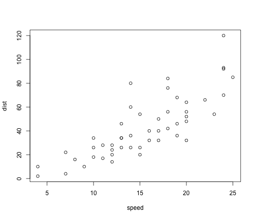
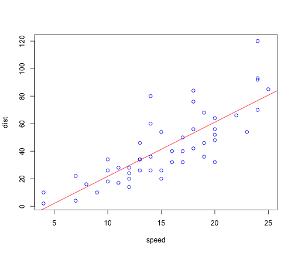
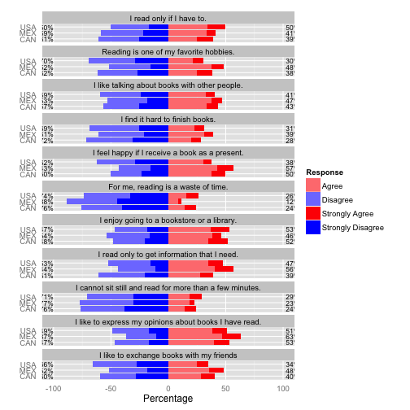

Title is very simple
========================================================

This is an R Markdown document. Markdown is a simple formatting syntax for authoring web pages (click the **MD** toolbar button for help on Markdown).

When you click the **Knit HTML** button a web page will be generated that includes both content as well as the output of any embedded R code chunks within the document. You can embed an R code chunk like this:


```r
summary(cars)
```

```
##      speed           dist    
##  Min.   : 4.0   Min.   :  2  
##  1st Qu.:12.0   1st Qu.: 26  
##  Median :15.0   Median : 36  
##  Mean   :15.4   Mean   : 43  
##  3rd Qu.:19.0   3rd Qu.: 56  
##  Max.   :25.0   Max.   :120
```


You can also embed plots, for example: thsi is good example


```r
plot(cars)
```

 


```r
plot(cars, col = "blue")
abline(lm(cars$dist ~ cars$speed), col = "red")
```

 


```r
library(likert)
```

```
## Loading required package: ggplot2
```

```
## Loading required package: xtable
```

```
## Loading required package: psych
```

```
## Attaching package: 'psych'
```

```
## The following object(s) are masked from 'package:ggplot2':
## 
## %+%
```

```
## Loading required package: reshape
```

```
## Loading required package: plyr
```

```
## Attaching package: 'reshape'
```

```
## The following object(s) are masked from 'package:plyr':
## 
## rename, round_any
```

```r
data(pisana)
items <- pisana[,c(
  'ST24Q01', #Only if I have to
	'ST24Q02', #Favourite hobbies
	'ST24Q03', #Talk about books
	'ST24Q04', #Hard to finish
	'ST24Q05', #Happy as present
	'ST24Q06', #Waste of time
	'ST24Q07', #Enjoy library
	'ST24Q08', #Need information
	'ST24Q09', #Cannot sit still
	'ST24Q10', #Express opinions
	'ST24Q11'  #Exchange
	)]
names(items) <- c("I read only if I have to.",
		"Reading is one of my favorite hobbies.",
		"I like talking about books with other people.",
		"I find it hard to finish books.",
		"I feel happy if I receive a book as a present.",
		"For me, reading is a waste of time.",
		"I enjoy going to a bookstore or a library.",
		"I read only to get information that I need.",
		"I cannot sit still and read for more than a few minutes.",
		"I like to express my opinions about books I have read.",
		"I like to exchange books with my friends")
for(i in 1:ncol(items)) {
	items[,i] <-  factor(items[,i], levels=c(1,2,3,4), ordered=TRUE,
		labels=c('Strongly Disagree', 'Disagree', 'Agree', 'Strongly Agree'))
}
l <- likert(items, grouping=pisana$CNT)
```

Plot the results.

```r
plot(l, centered = TRUE)
```

 


```r
options(width = 120)
summary(l)
```

```
##    Group                                                     Item   low  high  mean     sd
## 1    CAN                                I read only if I have to. 60.83 39.17 2.278 1.0002
## 2    CAN                   Reading is one of my favorite hobbies. 61.97 38.03 2.247 0.9946
## 3    CAN            I like talking about books with other people. 56.91 43.09 2.275 0.9467
## 4    CAN                          I find it hard to finish books. 71.77 28.23 2.054 0.9212
## 5    CAN           I feel happy if I receive a book as a present. 50.14 49.86 2.384 0.9731
## 6    CAN                      For me, reading is a waste of time. 75.72 24.28 1.945 0.9748
## 7    CAN               I enjoy going to a bookstore or a library. 48.27 51.73 2.480 1.0039
## 8    CAN              I read only to get information that I need. 61.24 38.76 2.293 0.9193
## 9    CAN I cannot sit still and read for more than a few minutes. 76.16 23.84 1.951 0.9534
## 10   CAN   I like to express my opinions about books I have read. 46.59 53.41 2.496 0.9273
## 11   CAN                 I like to exchange books with my friends 59.60 40.40 2.239 0.9931
## 12   MEX                                I read only if I have to. 58.64 41.36 2.274 0.8913
## 13   MEX                   Reading is one of my favorite hobbies. 51.69 48.31 2.436 0.8727
## 14   MEX            I like talking about books with other people. 53.23 46.77 2.372 0.8832
## 15   MEX                          I find it hard to finish books. 61.02 38.98 2.258 0.8784
## 16   MEX           I feel happy if I receive a book as a present. 42.96 57.04 2.557 0.9166
## 17   MEX                      For me, reading is a waste of time. 88.40 11.60 1.699 0.7522
## 18   MEX               I enjoy going to a bookstore or a library. 53.62 46.38 2.386 0.8478
## 19   MEX              I read only to get information that I need. 43.58 56.42 2.606 0.8836
## 20   MEX I cannot sit still and read for more than a few minutes. 76.99 23.01 1.974 0.8196
## 21   MEX   I like to express my opinions about books I have read. 36.67 63.33 2.690 0.8728
## 22   MEX                 I like to exchange books with my friends 51.75 48.25 2.430 0.9344
## 23   USA                                I read only if I have to. 50.17 49.83 2.485 0.9542
## 24   USA                   Reading is one of my favorite hobbies. 69.60 30.40 2.107 0.9298
## 25   USA            I like talking about books with other people. 59.45 40.55 2.240 0.9077
## 26   USA                          I find it hard to finish books. 68.94 31.06 2.138 0.8876
## 27   USA           I feel happy if I receive a book as a present. 62.03 37.97 2.166 0.9255
## 28   USA                      For me, reading is a waste of time. 74.00 26.00 2.030 0.9463
## 29   USA               I enjoy going to a bookstore or a library. 46.56 53.44 2.514 0.9768
## 30   USA              I read only to get information that I need. 52.74 47.26 2.439 0.8968
## 31   USA I cannot sit still and read for more than a few minutes. 71.15 28.85 2.087 0.9504
## 32   USA   I like to express my opinions about books I have read. 49.11 50.89 2.464 0.9178
## 33   USA                 I like to exchange books with my friends 65.54 34.46 2.165 0.9386
```


