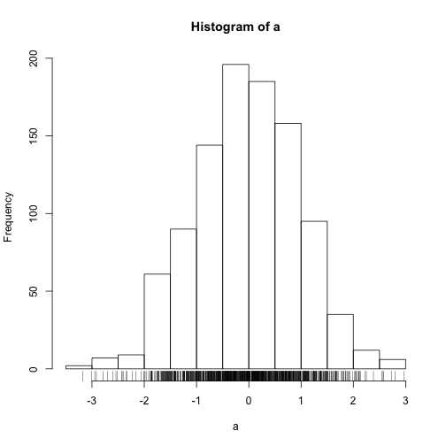

This is a very first attempt to make blog post with GitHub hosted cite using RStudio and knitr to get done the job.
========================================================

```r
a <- rnorm(1000)
hist(a)
rug(a)
```

 


